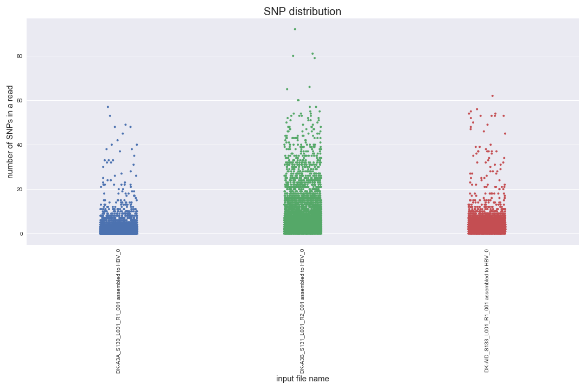
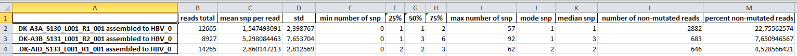

# apobec
`apobec` contains two in-house scripts that are used for NGS data analysis by HBV crispr/cas9 research group. 

## Installation
```
pip install apobec
```
## Usage
`apobec` intended to be used in Jupyter Notebook. Create folder named `input_data` and put your fastas into it. Navigate into the directory which contains the `input_data` folder. Then import the package :
```python
import apobec
```
and run :
```python
%run -m apobec.count_snp_duplex
%run -m apobec.snp_rate
```

## Description
The scripts take fasta alignment as an input. The input file is the result of deep sequencing reads mapping onto the reference sequence and is imported from the Geneious software.

`count_snp_duplex.py` counts  SNP in dinucleotide duplex context.

`count_snp_duplex.py` outputs summary bar charts : 


and excel spreadsheets to further manipulate the data  :


`snp_rate.py` counts SNP in each read.

It outputs a distribution plot:


and also raw count and summary statistics in excel spreadsheets:


## Requirements
- Python 3
- biopython
- matplotlib
- numpy
- pandas
- seaborn
