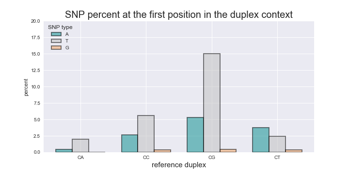
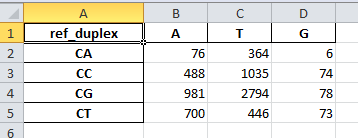
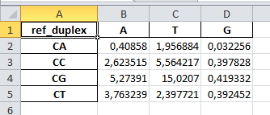

# apobec
`apobec` contains two scripts that are used for NGS data analysis by HBV crispr/cas9 research group. 

## Requirements
- Python 3
- Biopython
- matplotlib
- seaborn
- pandas

## Installation
The package is not avialable now via `pip`. So, just download and unpack it.

## Description
This script takes fasta alignment as an input. The input file is the result of deep sequencing reads mapping onto the reference sequence and is imported from the Geneious software.

`count_snp_duplex.py` counts  SNP in dinucleotide duplex context.

`count_snp_duplex.py` outputs summary bar charts : 

and excel spreadsheets to further manipulate the data  :

