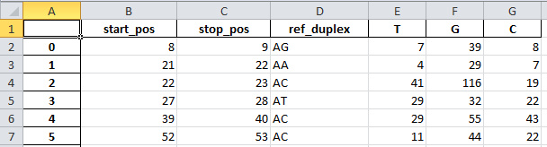

# apobec
### NGS data analysis for HBV crispr/cas9 research group

This script takes fasta alignment as an input. The input file is the result of reads mapping onto the reference sequence. `apobec` counts  SNP in dinucleotide duplex context.

`apobec` outputs summary bar charts : 

and excel spreadsheets to further manipulate the data  :

